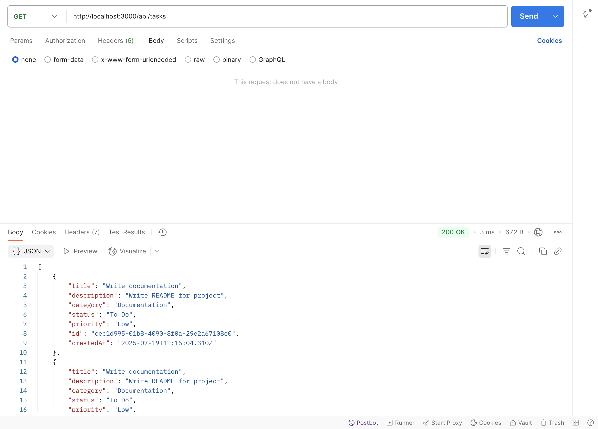
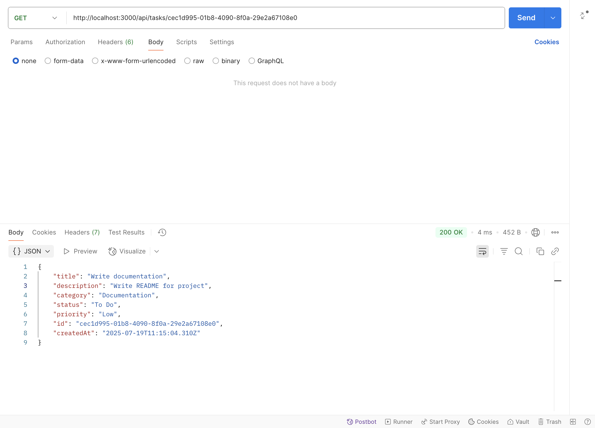
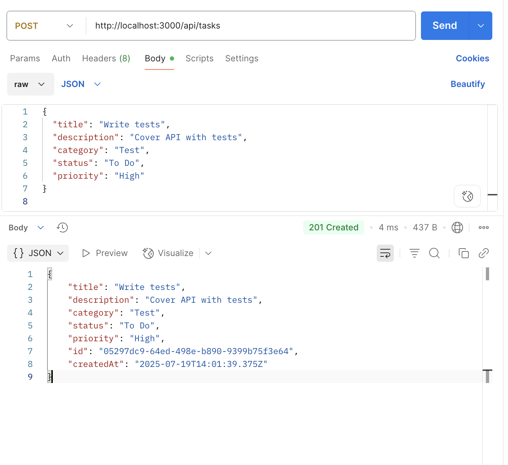
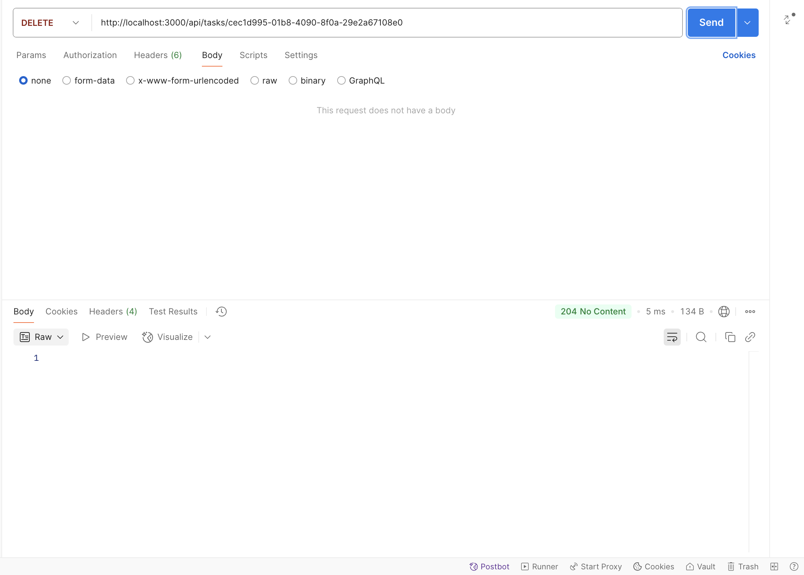

# T1-Task-Manager — Server

Backend REST API для управления задачами с использованием **Node.js**, **Express** и **TypeScript**.

## Stack

- Node.js + Express
- TypeScript
- In-memory data store (array)
- ESLint + Prettier

## Эндпойнты API

```http
GET    /tasks         # Получить все задачи
GET    /tasks/:id     # Получить задачу по ID
POST   /tasks         # Создать новую задачу
PATCH  /tasks/:id     # Обновить задачу по ID
DELETE /tasks/:id     # Удалить задачу по ID
```

## Примеры работы в Postman

### GET — gолучtybt всех задач:


---

### GET BY ID — получение задачи по ID:


---

### POST — cоздание новой задачи:


---

### PATCH — обновление задачи:


---

### DELETE — удаление задачи:


## Установка

### 1. Клонирование репозитория:
```bash
git clone https://github.com/Disielsida/T1-task-manager-server.git
```

### 2. Переход в директорию:
```bash
cd T1-task-manager-server/server
```

### 3. Установить зависимости:
```bash
npm install
```

### 4. Запустить сервер:
```bash
npm run dev
```