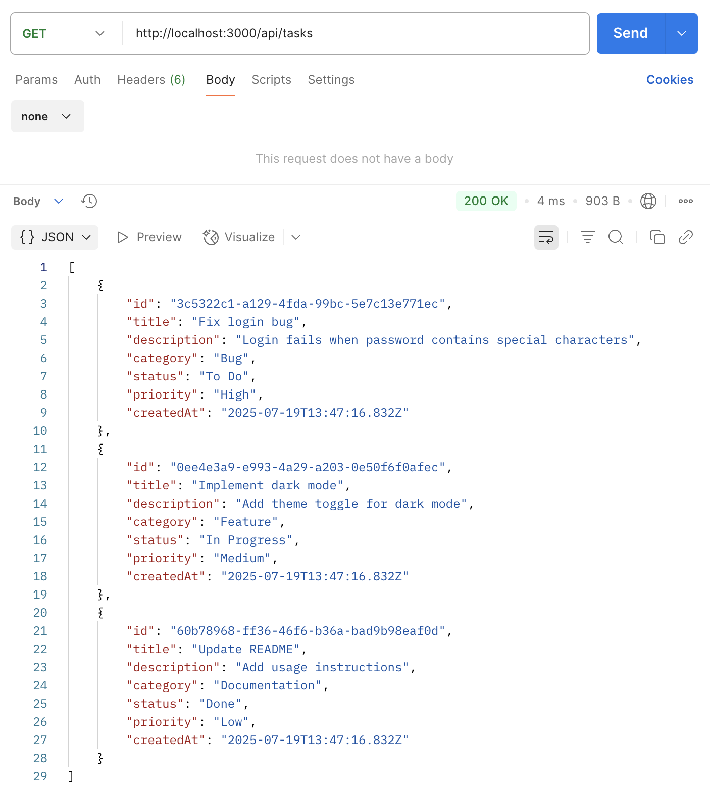
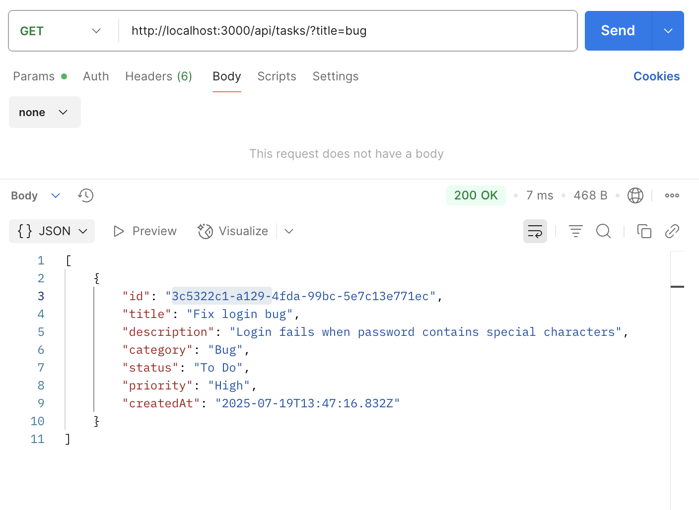

# T1-Task-Manager — Server

Backend REST API для управления задачами с использованием **Node.js**, **Express** и **TypeScript**.

## Стек технологий

- Node.js + Express
- TypeScript
- In-memory data store (array)
- ESLint + Prettier

## Функциональность

- Получение списка всех задач
- Получение задачи по ID
- Создание новой задачи
- Обновление существующей задачи
- Удаление задачи
- Поиск задач по заголовку через query-параметр (?title=)

## Архитектура проекта

Проект построен по слоям:

- `controllers/` — содержит обработчики маршрутов (логика работы с запросами)
- `models/` — реализует доступ к данным (хранение, поиск, изменение)
- `data/` — инициализация in-memory данных (массив задач)
- `routes/` — маршруты Express
- `types/` — типы данных TypeScript

Все слои разделены и не пересекаются напрямую, только через импорты.

## Эндпойнты API

```http
GET    /tasks         # Получить все задачи
GET    /tasks/:id     # Получить задачу по ID
POST   /tasks         # Создать новую задачу
PATCH  /tasks/:id     # Обновить задачу по ID
DELETE /tasks/:id     # Удалить задачу по ID
```

## Примеры работы в Postman

### GET — получение всех задач:


---

### GET BY ID — получение задачи по ID:


---

### GET BY TITLE — получение задач с заданным словом в заголовке:


---

### POST — cоздание новой задачи:


---

### PATCH — обновление задачи:


---

### DELETE — удаление задачи:


## Установка

### 1. Клонирование репозитория:
```bash
git clone https://github.com/Disielsida/T1-task-manager-server.git
```

### 2. Переход в директорию:
```bash
cd T1-task-manager-server/server
```

### 3. Установить зависимости:
```bash
npm install
```

### 4. Запустить сервер:
```bash
npm run dev
```